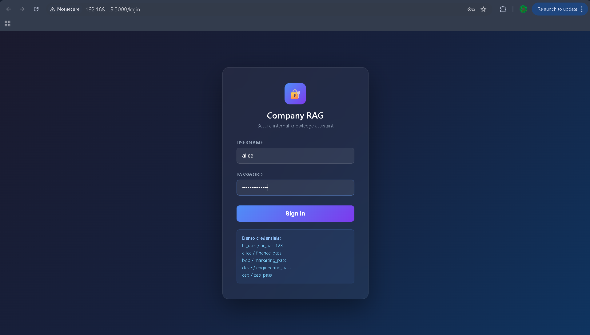
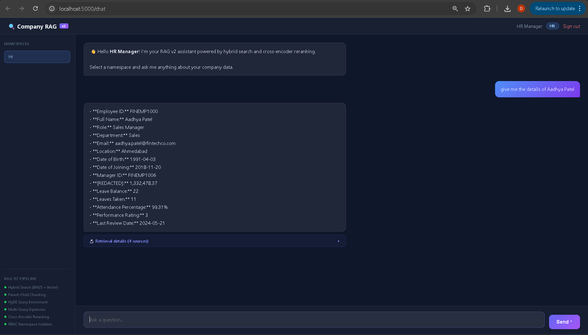
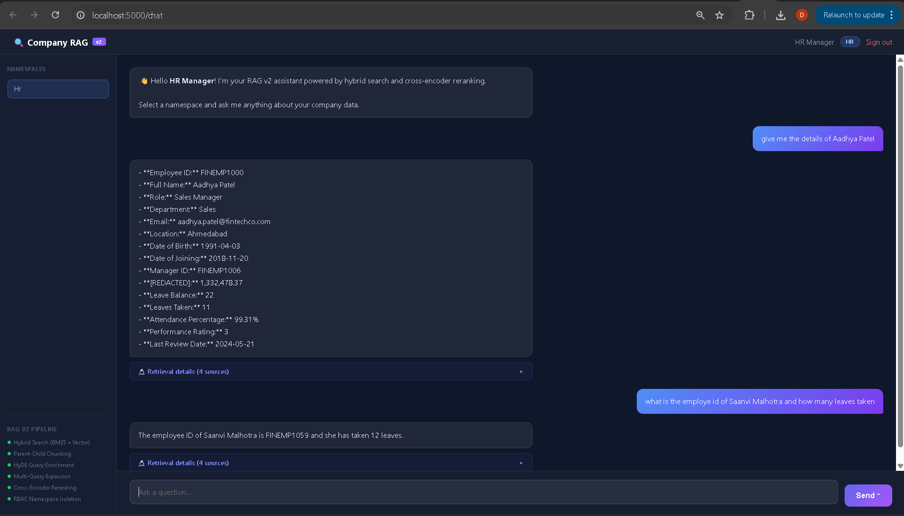

# 🧠 Enterprise RAG System with RBAC

A production-ready Retrieval-Augmented Generation (RAG) platform built using Flask, LlamaIndex, ChromaDB, OpenAI, and advanced RAG v2 retrieval techniques.

The system enables secure enterprise knowledge search across multiple departments while enforcing Role-Based Access Control (RBAC) and improving answer quality through modern retrieval strategies such as Hybrid Search, HyDE, Query Expansion, Parent-Child Retrieval, and Cross-Encoder Re-ranking.

---

# 🚀 Key Features

### Enterprise Security

* Role-Based Access Control (RBAC)
* Namespace-based document isolation
* Sensitive data redaction
* Department-level permissions

### Advanced RAG v2 Retrieval

* Hybrid Search (Dense + BM25)
* HyDE Query Enrichment
* Multi-Query Expansion
* Parent-Child Chunking
* Auto-Merging Retrieval
* Cross-Encoder Re-ranking
* Retrieval Diagnostics

### Production Capabilities

* ChromaDB Persistent Vector Storage
* Multi-Department Knowledge Base
* Configurable LLM Provider
* Evaluation using RAGAS
* Scalable Ingestion Pipeline

---

# 🎯 Problem Statement

Traditional RAG systems often suffer from:

* Poor retrieval quality
* Missing relevant documents
* Context fragmentation
* Hallucinated responses
* Weak keyword matching

This project upgrades a standard RAG implementation into an enterprise-grade RAG v2 architecture that significantly improves retrieval precision and answer grounding.

---

# 🏗️ System Architecture

```text
User Query
     │
     ▼
RBAC Authorization
     │
     ▼
HyDE Query Generation
     │
     ▼
Multi Query Expansion
     │
     ▼
Hybrid Retrieval
(BM25 + Vector Search)
     │
     ▼
Parent-Child AutoMerging
     │
     ▼
Cross Encoder Re-ranking
     │
     ▼
Context Compression
     │
     ▼
GPT-4o Mini
     │
     ▼
Answer + Sources
```

---

# 📂 Project Structure

```text
rag_llamaindex_v2/

├── app/
│
├── auth/
│   ├── users.py
│   └── rbac.py
│
├── db/
│   └── vectorstore.py
│
├── ingestion/
│   ├── loader.py
│   └── metadata.py
│
├── rag/
│   ├── embeddings.py
│   ├── hyde.py
│   ├── retriever.py
│   ├── reranker.py
│   └── pipeline.py
│
├── scripts/
│   └── ingest.py
│
├── templates/
│   ├── login.html
│   └── chat.html
│
├── eval/
│   └── evaluate.py
│
├── data/
│
├── requirements.txt
├── main.py
└── .env
```
## 📸 Project Screenshots

### Login & Authentication



### Enterprise Chat Interface



### Retrieval Diagnostics



---

# 🔥 RAG v1 vs RAG v2

| Component         | RAG v1           | RAG v2                           |
| ----------------- | ---------------- | -------------------------------- |
| Chunking          | Flat Chunks      | Parent-Child Hierarchical Chunks |
| Search            | Vector Search    | Hybrid Search                    |
| Query Processing  | Raw Query        | HyDE + Query Expansion           |
| Context Retrieval | Leaf Chunks Only | AutoMerging Parent Context       |
| Ranking           | Similarity Score | Cross Encoder                    |
| Security          | None             | RBAC + Redaction                 |
| Evaluation        | Manual           | RAGAS                            |

---

# ⚙️ RAG v2 Techniques Explained

## 1. Parent-Child Chunking

### Why?

Large documents lose context when split into small chunks.

### Solution

Create:

Parent Nodes → 1024 Tokens

Child Nodes → 256 Tokens

Store both.

Index only child nodes.

When a child is retrieved, its parent context is also retrieved.

### Benefits

* Better context preservation
* Higher retrieval accuracy
* Reduced hallucinations

---

## 2. Hybrid Retrieval

### Problem

Vector Search:

Good for semantics.

Bad for exact keywords.

BM25:

Good for keywords.

Bad for semantic meaning.

### Solution

Combine both retrieval methods.

```python
Hybrid Score =
Dense Similarity
+
BM25 Similarity
```

### Benefits

* Better recall
* Better precision
* Improved retrieval coverage

---

## 3. HyDE Retrieval

### Full Form

Hypothetical Document Embeddings

### Example

User Query:

```text
What benefits are available for employees?
```

GPT generates:

```text
Employees receive health insurance,
paid leave, retirement plans,
and performance bonuses.
```

Embedding is created from the generated answer instead of the original query.

### Benefits

* Better semantic retrieval
* Improved matching
* Higher recall

---

## 4. Multi Query Expansion

Instead of one query:

```text
How does leave policy work?
```

Generate:

```text
Explain employee leave policy

Paid leave rules

Leave management guidelines
```

Retrieve documents for all queries.

### Benefits

* Increased search coverage
* Reduced missed documents

---

## 5. AutoMerging Retriever

After retrieval:

```text
Child A
Child B
Child C
```

If enough children belong to the same parent:

```text
Replace with Parent Node
```

### Benefits

* Larger context windows
* Better answer generation

---

## 6. Cross Encoder Re-ranking

Retriever returns:

```text
Top 20 Chunks
```

Cross Encoder evaluates:

```text
(Query, Chunk)
```

Pairs together.

Example:

```text
Chunk A = 0.95

Chunk B = 0.48
```

Keep only the highest-quality chunks.

### Benefits

* Better ranking
* More relevant context

---

## 7. Context Compression

Removes irrelevant information before sending context to the LLM.

### Benefits

* Lower token usage
* Faster response generation
* Better grounding

---

# 🔄 End-to-End Flow

## Document Ingestion

```text
Upload Documents
       │
       ▼
Metadata Tagging
       │
       ▼
Parent Chunk Creation
       │
       ▼
Child Chunk Creation
       │
       ▼
Embedding Generation
       │
       ▼
Store in ChromaDB
```

---

## User Query

```text
Question
    │
    ▼
RBAC Check
    │
    ▼
HyDE Generation
    │
    ▼
Query Expansion
    │
    ▼
Hybrid Search
    │
    ▼
AutoMerging
    │
    ▼
Re-ranking
    │
    ▼
LLM Generation
    │
    ▼
Response
```

---

# 📊 Evaluation

Evaluation performed using RAGAS.

Metrics:

* Faithfulness
* Context Precision
* Context Recall
* Answer Relevancy

```bash
python eval/evaluate.py
```

---

# 🛠️ Tech Stack

Backend

* Flask
* Python

Retrieval

* LlamaIndex
* ChromaDB
* BM25

Embeddings

* Sentence Transformers
* BGE Models

Re-ranking

* Cross Encoder
* MS MARCO MiniLM

LLM

* GPT-4o Mini
* OpenAI

Evaluation

* RAGAS

---

# 🚀 Installation

### Create Environment

```bash
python -m venv .venv
```

### Activate

```bash
source .venv/bin/activate
```

Windows

```bash
.venv\Scripts\activate
```

### Install Dependencies

```bash
pip install -r requirements.txt
```

### Configure Environment

```bash
cp .env.example .env
```

Add:

```env
OPENAI_API_KEY=your_key
```

### Ingest Documents

```bash
python scripts/ingest.py
```

### Start Application

```bash
python main.py
```

Open:

```text
http://localhost:5000
```

---

# 📈 Production Benefits

* Higher retrieval accuracy
* Better context understanding
* Reduced hallucinations
* Enterprise-grade access control
* Lower token consumption
* Improved answer relevance
* Scalable architecture

---

# Future Improvements

* Agentic RAG
* Knowledge Graph Retrieval
* GraphRAG
* Semantic Caching
* Multi-Vector Retrieval
* AWS Deployment
* Kubernetes Scaling
* Monitoring with LangSmith
