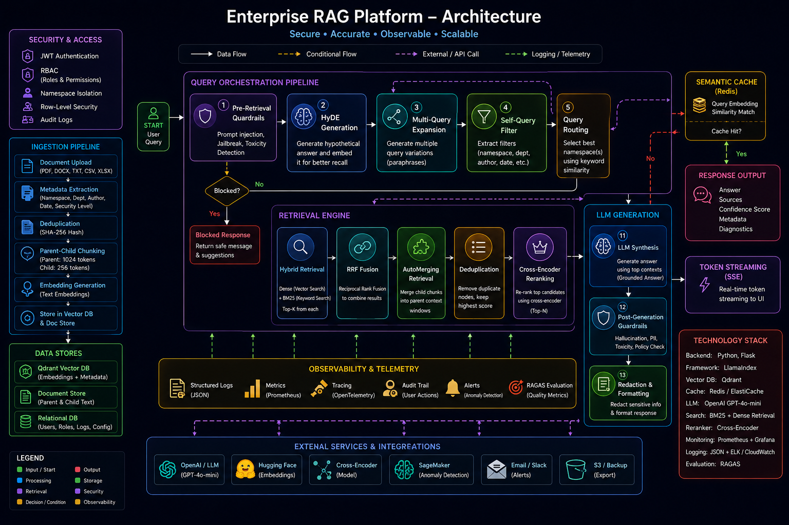

# Enterprise RAG Platform with RBAC

Enterprise RAG Platform is a production-focused Retrieval-Augmented Generation system designed for secure knowledge retrieval across multiple departments.
Unlike basic RAG applications that rely only on vector search, this platform combines advanced retrieval, reranking, security, caching, observability, and role-based access control to improve answer quality and enterprise readiness.

## Why This Project
Traditional RAG systems face several challenges:
* Relevant documents are often missed during retrieval
* Retrieved documents may be ranked incorrectly
* LLMs can generate hallucinated answers
* Users may access information outside their permissions
* Repeated questions increase latency and API costs
* Limited visibility into system performance

This project addresses these challenges using modern RAG v2 and enterprise retrieval techniques.

## Key Features
* Role-Based Access Control (RBAC)
* JWT Authentication
* Qdrant Vector Database
* Hybrid Retrieval (Dense + BM25)
* HyDE Query Expansion
* Multi-Query Retrieval
* Metadata Filtering
* Query Routing
* AutoMerging Retrieval
* Cross-Encoder Reranking
* Semantic Response Caching
* Prompt Injection Guardrails
* Hallucination Detection
* SSE Token Streaming
* Structured Logging
* Telemetry and Observability
* RAGAS Evaluation

## Architecture
Document Ingestion
Documents
→ Metadata Extraction
→ Deduplication
→ Parent-Child Chunking
→ Embedding Generation
→ Qdrant Storage



Query Pipeline
User Query
→ Guardrails
→ Semantic Cache
→ HyDE
→ Query Expansion
→ Metadata Filtering
→ Query Routing
→ Hybrid Retrieval
→ AutoMerging
→ Reranking
→ LLM Generation
→ Post-Processing
→ Final Response

## Advanced Retrieval Techniques

### Hybrid Retrieval
Combines vector search and BM25 keyword search to improve retrieval accuracy.

### HyDE
Generates a hypothetical answer before retrieval, improving semantic search quality.

### Multi-Query Expansion
Creates multiple query variations to increase recall.

### Metadata Filtering
Extracts structured filters such as department, namespace, author, or date from user queries.

### AutoMerging Retrieval
Retrieves precise child chunks and expands them into larger parent contexts.

### Cross-Encoder Reranking
Reranks retrieved documents based on true query-document relevance.

## Security
* Role-based access control
* Namespace isolation
* JWT authentication
* Prompt injection protection
* Jailbreak detection
* PII detection
* Output moderation

## Tech Stack
Backend
* Python
* Flask
* LlamaIndex
Retrieval
* Qdrant
* BM25
* Sentence Transformers
* Cross Encoder Reranker
LLM
* OpenAI GPT-4o-mini
Evaluation

* RAGAS
Monitoring
* Structured JSON Logging
* Telemetry Metrics

## Project Structure

app/
├── auth/
├── db/
├── ingestion/
├── rag/
├── services/
├── utils/

evaluation/
scripts/
templates/
data/
db/

## Result


## Installation

Clone the repository
```bash
git clone <repository-url>
cd enterprise-rag-platform
```
Create a virtual environment
```bash
python -m venv .venv
```
Activate environment
```bash
source .venv/bin/activate
```
Install dependencies
```bash
pip install -r requirements.txt
```
Configure environment variables
```env
OPENAI_API_KEY=your_key
```
Run ingestion
```bash
python scripts/ingest.py
```
Start the application
```bash
python main.py
```
Open
```text
http://localhost:5000
```
## Results
* Higher retrieval accuracy through hybrid search and reranking
* Reduced hallucinations using grounded retrieval
* Faster responses through semantic caching
* Secure department-level document access
* Production-ready monitoring and logging

## Future Improvements
* Agentic Retrieval
* Knowledge Graph Integration
* Distributed Qdrant Deployment
* Kubernetes Deployment
* AWS Production Infrastructure
* Continuous Evaluation Pipeline

## Conclusion

This project demonstrates how modern enterprise RAG systems can move beyond simple vector search by combining retrieval optimization, security, observability, and evaluation into a production-ready architecture.
